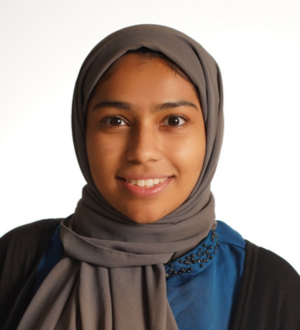
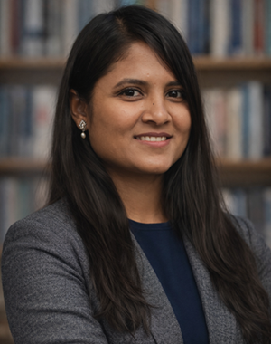
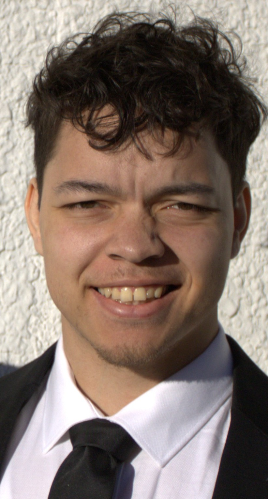

## Director

:::::: columns
::: {.column width="25%"}
{fig-alt="Jean-Christophe Boucher"}
:::

::: {.column width="5%"}
:::

::: {.column width="70%"}
### Jean-Christophe Boucher

Jean-Christophe Boucher is an Associate Professor at the Department of Political Science at the University of Calgary. His current work focuses on applying machine learning to understand how the digital world shapes society, particularly in the context of foreign information manipulation and interference. He is a Fulbright Scholar and manages projects funded by the Social Sciences and Humanities Research Council (SSHRC) and the Department of National Defence. In 2025, he served as Deputy Director - Data Science within the Rapid Response Mechanism (RRM) at Global Affairs Canada. He specializes in international relations, with a focus on foreign policy, global security, and data analytics.

Jean-Christophe Boucher est professeur associé au département de sciences politiques de l'université de Calgary. Ses travaux actuels portent sur l’application de l’apprentissage automatique pour comprendre comment le monde numérique façonne la société, notamment en ce qui concerne la manipulation de l’information et l’interférence étrangère. Il est titulaire d'une bourse Fulbright et est actuellement responsable de projets financés par le Conseil de recherches en sciences humaines (CRSH) et la défense nationale. En 2025, il a occupé le poste de directeur adjoint – Science des données au sein du Mécanisme de réponse rapide (RRM) d'Affaires mondiales Canada. Il est spécialisé dans l'analyse de la politique étrangère, la sécurité internationale et l'analyse de données.
:::
::::::

## Research Team Leads

:::::: columns
::: {.column width="25%"}
{fig-alt="Israa Farouk"}
:::

::: {.column width="5%"}
:::

::: {.column width="70%"}
### Israa Farouk

Israa Farouk is the Team Lead on Computer Science, bringing her expertise in data science and analytics to support the group's research. She earned her Master's degree in Data Science and Analytics from the University of Calgary, where her work focused on applying statistical and machine learning techniques to complex datasets.

Israa supports evidence-based research by applying data analysis and visualization techniques to inform policy development. She is passionate about using innovative analytical approaches to promote sustainable practices and inform evidence-based decision-making.
:::
::::::

:::::: columns
::: {.column width="25%"}
{fig-alt="David Dubé"}
:::

::: {.column width="5%"}
:::

::: {.column width="70%"}
### David Dubé

David Dubé is a PhD Candidate in Political Science at McGill University and the Research Team Lead for the Information Security and Influence Team, which he joined in October 2022. His research examines how state actors exploit digital information ecosystems to promote strategic narratives, influence political interpretation, and contest international order. This work is especially concerned with the measurement and detection of misinformation, foreign influence, and inauthentic or synthetic content across digital platforms.

Through past experience as a Senior Data Analyst with Global Affairs Canada's Rapid Response Mechanism, David leads applied research and analytical work on foreign information manipulation targeting Canada and its allies. Methodologically, he combines qualitative, quantitative, and computational approaches, including natural language processing, machine learning, and large-scale text analysis, applied to comparative political economy and the study of disinformation strategies employed by authoritarian and great-power states.

David holds a Master's degree in Political Science and International Relations from the University of Quebec at Montréal, where he wrote his thesis on the construction of Russia's revanchist identity and the annexation of Crimea.
:::
::::::

## Information Security and Influence Team

:::::: columns
::: {.column width="25%"}
{fig-alt="Lily Dey"}
:::

::: {.column width="5%"}
:::

::: {.column width="70%"}
### Lily Dey

Lily is a PhD student in the Department of Computer Science at the University of Calgary, working on trustworthy multimodal AI. Her doctoral research focuses on cross-modal identity leakage in fused biometric systems, showing that privacy protections applied to individual modalities such as face and voice can still leak identity information once those modalities are combined.

In parallel, her work extends into computational political science, where she examines cross-lingual and cross-national variation in threat construal within legislative discourse, leveraging large-scale transformer architectures to model pragmatic and entailment-based semantic structure across geopolitical contexts. Her earlier work in deception detection, spanning both classical feature-engineered NLP pipelines and, more recently, fusion-based trust modeling frameworks, has contributed to the broader methodological foundation connecting her current research directions in robustness, calibration, and epistemic trust in machine learning systems.
:::
::::::

:::::: columns
::: {.column width="25%"}
{fig-alt="Garima Chahal"}
:::

::: {.column width="5%"}
:::

::: {.column width="70%"}
### Garima Chahal

Garima Chahal is a final-year Political Science and International Relations student at the University of Calgary with interests in democratic participation, human rights, and political communication. She is a two-time recipient of the University of Calgary's Program for Undergraduate Research Experience (PURE) award, most recently in Summer 2026, through which she has conducted independent research on political participation among South Asian youth in Calgary under the supervision of Dr. Jean-Christophe Boucher.

Garima has also worked as a research assistant on projects examining digital information spaces and global politics and with the Alberta Civil Liberties Research Centre on civil liberties and human rights issues. She has also published papers in student journals, including the *Canadian Law Review*, *Insights* Political Science Undergraduate Journal, and *The Motley Journal*, where she also serves as an editor and peer-reviewer.

Beyond research, Garima is extensively involved in campus leadership and media. She serves as Vice-President Internal of the Political Science Students' Association and has held leadership roles with Model United Nations. She is also a two-time Yacowar Award-winning journalist with The Gauntlet and has contributed to campus media through CJSW and NUTV.
:::
::::::

## Defence and Foreign Policy Team

:::::: columns
::: {.column width="25%"}
{fig-alt="Ethan Boyda"}
:::

::: {.column width="5%"}
:::

::: {.column width="70%"}
### Ethan Boyda

Ethan Boyda is a PhD student at the University of Calgary, with a focus on public finance and Canadian provincial politics. His research aims to understand the links between party politics and public policy in the Canadian provinces. Drawing on the party systems, economics, and public administration literatures, he develops theories linking levels of party competition and government ideology to government spending across Canada. His doctoral thesis will expand to integrate elements such as electoral and business cycles, ethnic fractionalization, provincial disaggregation, and internal trade barriers to build a more complete theory of provincial fiscal policy.

He is also interested in quantitative research methods and affective polarization, and is currently involved in survey research examining trust in the military across Canada and other NATO countries.
:::
::::::
